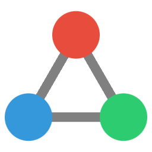

<p align="center">
 
 <h1 align="center">
  System 3 Website
 </h1>
</p>

The marketing site for [System 3](https://system3.md), built with SvelteKit.

## Overview

System 3 creates tools for knowledge workers and teams, starting with Relay - a collaboration plugin for Obsidian that enables real-time and asynchronous collaboration while maintaining data sovereignty.

## Documentation

This project's documentation has been moved to our internal handbook, available at `/handbook` when running the development server.

Visit:
- Development server: http://localhost:5173
- Project handbook: http://localhost:5173/handbook

Documentation sections:
- [Architecture](/handbook/architecture) - Technical implementation
- [Theme System](/handbook/theme-system) - Visual design and components
- [Content Strategy](/handbook/content-strategy) - Content guidelines
- [Current Todo](/handbook/todo) - Ongoing work

## Quick Start

```bash
# Install dependencies
pnpm install

# Start development server
pnpm dev

# Build for production
pnpm build
```

## Attribution & License

Built by modifying [shadcn-svelte](https://www.shadcn-svelte.com/) by [huntabyte](https://github.com/huntabyte). Modifications by Matt O'Brien.

Original shadcn-svelte components are under MIT license. System 3 modifications and content © 2024 No Instructions, LLC.

## Community

Join our [Discord server](https://discord.system3.md) for support and discussion.

Contact: matt@noinstructions.ai
