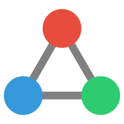

<p align="center">
 
 <h1 align="center">
  System 3 Website (/apps/www)
 </h1>
</p>

This is the main website application within the System 3 monorepo. For the root project README, see [../../README.md](../../README.md).

## Development Quick Start

```bash
# Install dependencies
pnpm install

# Start development server
pnpm dev

# Build for production
pnpm build
```

## Project Documentation

All technical documentation is in the `/docs` directory:

### Core Documentation
- [Content Strategy](docs/README-CONTENT-STRATEGY.md)
  - Writing guidelines
  - Audience definitions
  - Content types and templates

- [Theme System](docs/README-THEME-SYSTEM.md)
  - Brand colors and styles
  - Component theming
  - Dark/light mode

- [Content System](docs/README-CONTENT-SYSTEM.md)
  - Markdown processing
  - Navigation structure
  - Component embedding

### Directory Structure
```
apps/www/
├── docs/               # Project documentation
├── src/
│   ├── content/       # Markdown content
│   ├── lib/           # Components & utilities
│   └── routes/        # SvelteKit routes
└── static/            # Static assets
```

## Common Tasks

### Adding Content
1. Add markdown file to `src/content/`
2. Update navigation in `src/lib/config/productivity.ts`
3. See [Content System](docs/README-CONTENT-SYSTEM.md) for details

### Styling Components
1. Use theme variables for colors
2. Follow component patterns
3. See [Theme System](docs/README-THEME-SYSTEM.md) for details

### Writing Content
1. Follow style guide
2. Use templates
3. See [Content Strategy](docs/README-CONTENT-STRATEGY.md) for details

## Questions & Support

- Technical issues: matt@noinstructions.ai
- Content questions: See Content Strategy guide
- Discord: [discord.system3.md](https://discord.system3.md)
